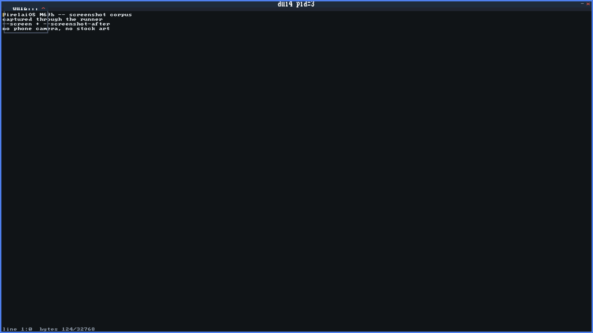

# DipshitOS

DipshitOS is a from-scratch AArch64 operating system. It boots under real UEFI
firmware on **Apple silicon**, hosted by Apple's **Virtualization.framework**
(macOS **27 or newer**). It is **not Linux, not Unix, and not QEMU** — no
libc, no POSIX, no existing guest OS, no emulator anywhere in the boot path.

The guest is written in freestanding [Zig](https://ziglang.org/) (no standard
library); the host launcher is Swift. The kernel seizes the machine itself:
it ends UEFI Boot Services, installs its own page tables, and drives the
hardware directly through virtio and MMIO drivers.

The name is a joke. The engineering is not. Every subsystem this site describes
is either **verified deterministically** or **live-gated on real hardware** —
see [[evidence]].

## Current status

Every milestone through twelve has landed; milestone thirteen (files &
applications) is in progress with two of four cards shipped:

| Milestone | What it is | Status |
|-----------|-----------|--------|
| Boot → kernel proper | UEFI boot pipeline, handoff, `ExitBootServices`, identity-map MMU, polled serial console | Done |
| Monitor | Interactive `dipshit>` kernel monitor (shell, filesystem, reboot/shutdown) | Done |
| Userspace | Allocator, GIC + timer, scheduler, EL0 + syscalls, uaccess, address spaces, exec | Done |
| Processes | Entropy/CSPRNG, process registry, IPC, wait, kill, concurrent programs | Done |
| Networking | virtio-net, ARP, IPv4/ICMP, UDP, DHCP, TCP, NAT | Done |
| Graphics | virtio-gpu framebuffer, text, Road Pops terminal, Driving Award window manager | Done |
| Input | USB XHCI, HID enumeration, keyboard events feeding the terminal | Done |
| Usability & HIG | ADR 0008: grouped `help`, line editing + history, one error contract, window chrome, `sysinfo`, persistent settings | Done |
| Events | Per-process event queues: keyboard/pointer/window events to focused EL0 apps (`sys_poll_event`/`sys_wait_event`) | Done |
| User filesystem ABI | Per-process file table, `/esp/` + `/data/` routing, file syscalls (slots 23–27), storage utilities | Done |
| Desktop platform | ADR 0011: zero-heap `ui.zig` widget toolkit + `CALC.BIN`, `NOTEPAD.BIN`, `TOP.BIN`, `DESKTOP.BIN` launcher | Done |
| Network apps | TCP syscall seam (slots 30–33), RFC 1035 DNS, `TCP.BIN`/`FETCH.BIN`/`CHAT.BIN` | Done |
| Files & applications | `APPS.TXT` manifest + `FILE.BIN` graphical data browser; delete/rename and desktop composition are the open cards | In progress |

The full, always-current accounting lives in the repository's
[`docs/status.md`](https://github.com/drawmeanelephant/DipshitOS/blob/main/docs/status.md).

<Aside kind="info">

**VERIFIED.** Everything on this site reflects what is actually landed and
live-gated today, not roadmap wishcasting. Where a feature is unit-tested
only, deterministic only, live-tested, or hardware-specific, the page says
which.

</Aside>

## What runs today

A single boot of DipshitOS gets you, in order:

- A UEFI boot loader that hands off to a freestanding kernel.
- A live interactive monitor (`dipshit>` prompt) over the serial console.
- A graphical framebuffer with a real terminal on screen — **Road Pops**.
- A window manager — **Driving Award** — compositing a terminal and a live
  clock overlay.
- EL0 user programs, exec'd from the disk, running as real processes with a
  34-slot syscall ABI (slots 0–33) covering IPC, windows, files, events,
  process control, and TCP.
- Networking from raw Ethernet frames up through ARP, IPv4/ICMP, UDP, DHCP,
  and a bounded TCP client — plus an RFC 1035 DNS resolver.
- USB keyboard input, enumerated over a real XHCI controller, typing into the
  terminal.
- A graphical desktop: the `DESKTOP.BIN` launcher with a working calculator
  (`CALC.BIN`), a persistent text editor (`NOTEPAD.BIN`), a click-to-kill
  process monitor (`TOP.BIN`), and a file browser over the DATA partition
  (`FILE.BIN`).
- Userland network applications: an HTTP/1.0 client (`FETCH.BIN`) and a
  peer-to-peer graphical chat app (`CHAT.BIN`).
- Keyboard, pointer, and window events routed to focused applications, so an
  EL0 program runs an interactive event loop.

*A live boot captured by the ScreenCaptureKit evidence path: Road Pops renders
real echoed commands on screen while the Driving Award clock overlay composites
in the top-right corner.*

## What it runs on

- **Host:** Apple silicon, macOS 27 or newer, Apple's Virtualization.framework.
- **Guest:** AArch64, freestanding Zig (pinned **Zig 0.16.0**), no libc.
- **Not supported:** Linux, Unix, QEMU, x86, any other emulator. There is
  deliberately no QEMU path.

## Start here

- [[getting-started|Getting started]] — build it, run it, what you need.
- [[architecture|Architecture]] — how the kernel and its subsystems fit together.
- [[capabilities|Current capabilities]] — what actually works today, subsystem by subsystem.
- [[roadmap|Roadmap & status]] — what has landed and what comes next.
- [[names|Project names & lore]] — what "Road Pops" and "Driving Award" mean.
- [[evidence|Evidence & testing]] — how a claimed feature is proven to work.

## Who this is for

Someone who looks at an operating system called *DipshitOS* and still wants to
know how the MMU handoff works, how the compositor repaints, or how a DHCP
lease is renewed — and who appreciates that the answer comes with a gate and a
claim number instead of a screenshot and a shrug.

<Aside kind="warning">

**LIMITATION.** This is a research/hobby operating system running inside a
virtual machine on one vendor's hardware. It is not a general-purpose OS, not
production software, and not a drop-in for anything you already run.

</Aside>
