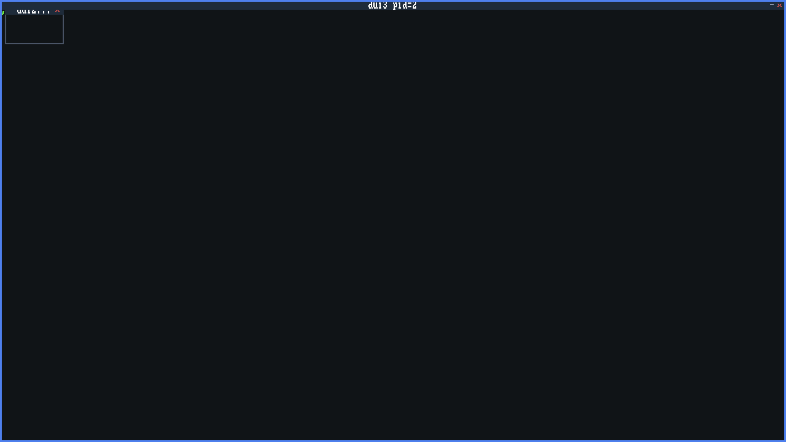
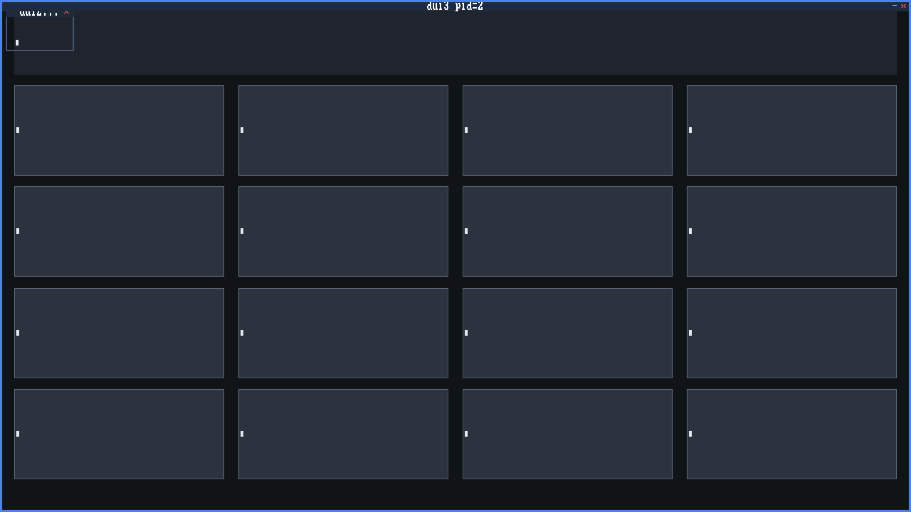
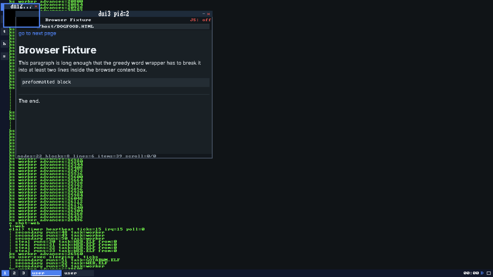

# VirelaiOS

VirelaiOS is a from-scratch AArch64 operating system. It boots under real UEFI
firmware on **Apple silicon**, hosted by Apple's **Virtualization.framework**
(macOS **27 or newer**). It is **not Linux, not Unix, and not QEMU** — no
libc, no POSIX, no existing guest OS, no emulator anywhere in the boot path.

The guest is written in freestanding [Zig](https://ziglang.org/) (no standard
library); the host launcher is Swift. The kernel seizes the machine itself:
it ends UEFI Boot Services, installs its own page tables, and drives the
hardware directly through virtio and MMIO drivers.

The name is a joke. The engineering is not. Every subsystem this site describes
is either **verified deterministically** or **live-gated on real hardware** —
see [[evidence]].

## Current status

Every milestone through **M74** is closed on the tracker (2026-09-23) except
**M73**, which waits on its acceptance card. The table below is the first 31 —
the arc this site grew alongside; the
always-current accounting for everything since is
[`docs/status.md`](https://github.com/drawmeanelephant/DipshitOS/blob/main/docs/status.md)
and [[roadmap]]:

| Milestone | What it is | Status |
|-----------|-----------|--------|
| Boot → kernel proper | UEFI boot pipeline, handoff, `ExitBootServices`, identity-map MMU, polled serial console | Done |
| Monitor | Interactive `virelai>` kernel monitor (shell, filesystem, reboot/shutdown) | Done |
| Userspace | Allocator, GIC + timer, scheduler, EL0 + syscalls, uaccess, address spaces, exec | Done |
| Processes | Entropy/CSPRNG, process registry, IPC, wait, kill, concurrent programs | Done |
| Networking | virtio-net, ARP, IPv4/ICMP, UDP, DHCP, TCP, NAT | Done |
| Graphics | virtio-gpu framebuffer, text, Road Pops terminal, Driving Award window manager | Done |
| Input | USB XHCI, HID enumeration, keyboard events feeding the terminal | Done |
| Usability & HIG | ADR 0008: grouped `help`, line editing + history, one error contract, window chrome, `sysinfo`, persistent settings | Done |
| Events | Per-process event queues: keyboard/pointer/window events to focused EL0 apps (`sys_poll_event`/`sys_wait_event`) | Done |
| User filesystem ABI | Per-process file table, `/esp/` + `/data/` routing, file syscalls (slots 23–27), storage utilities | Done |
| Desktop platform | ADR 0011: zero-heap `ui.zig` widget toolkit + `CALC.BIN`, `NOTEPAD.BIN`, `TOP.BIN`, `DESKTOP.BIN` launcher (Zig `NOTEPAD.BIN` since retired — the editor is the Go `NOTE.ELF`, M66c) | Done |
| Network apps | TCP syscall seam (slots 30–33), RFC 1035 DNS, `TCP.BIN`/`FETCH.BIN`/`CHAT.BIN` | Done |
| Files & applications | Mutating filesystem seam (slots 34–37), `APPS.TXT` manifest, graphical data browser (now `GOFILES.ELF`), desktop composition | Done |
| Shared services | Clipboard + app timers + composition capstone + isolation hardening (slots 38–41) | Done |
| Audio | virtio-snd, PCM playback, `beep`, the EL0 audio seam (slots 42–45), `JINGLE.BIN` + the boot chime + `CHIME.BIN` | Done |
| Internals consolidation | Multi-segment user images, guard pages, measured pools (issues #190–#193) | Done |
| Desktop completeness | Widget depth, window management, app upgrades, rich interactions, system polish (M17 + Arc1–5) | Done |
| Terminal & shell depth | Scrollback, selection, search, persistent history, colors, scripting (M18) | Done |
| Shell programming | Pipes, redirection, environment variables, functions, substitution, arithmetic, conditionals (M19) | Done |
| Text rendering & Unicode | Font sizes, Unicode glyphs, search, chrome, tabs (M20) | Done |
| Window management depth | Tiling, master-detail, minimize, alt-tab, notification center, focus rings (M21) | Done |
| Developer tools | ELF loader, assembler, symbols, disassembler, strace (M22) | Done |
| The text editor | `EDIT.BIN` with undo/redo, goto, tabs, syntax, console split (M23; the Zig editor was retired — Go `GOEDIT.ELF`/`NOTE.ELF`) | Done |
| CALC grows up | Programmer mode, memory, units, constants, history (M24) | Done |
| File manager depth | du, sort, overwrite/conflict, path copy (M25) | Done |
| Network experience | ping, netstat, traceroute, HTTP fetch display, offline preflight (M26) | Done |
| Desktop polish | G1–G30: splash, wizard, about, previews, sounds, sysmon, tooltips, audits, dogfood (M27) | Done |
| Symmetric multi-processing | A second CPU core online via PSCI, per-core schedulers, spinlocks, GICv3 IPIs (M28) | Done |
| VM depth | Demand paging, copy-on-write, anonymous `sys_mmap`/`sys_munmap` (M29) | Done |
| Dynamic linking | Freestanding `LD.SO` + `LIBUI.SO`/`LIBFONT.SO`, W^X multi-aperture isolation (M30) | Done |
| Dyn-linking ecosystem | `CALC.ELF`/`NOTEPAD.ELF`/`FILE.ELF`/`DESKTOP.ELF`, runtime `dlopen`/`dlsym` (M31) | Done |

**The boot default is the Go seat.** A single boot autostarts `GOTABWM.ELF`,
which hosts Go EL0 clients — the shell `GOSH.ELF`, the editor `NOTE.ELF`, the
calculator `GOCALC.ELF`, the browser `WEB.ELF` — as tabs over the `WM_RPC`
contract; Zig `TABWM.BIN` is retained by decision (ADR 0034) as the
`settings set wm tabwm` fallback. M71 seat honesty and M72 Charm TUI have
closed since — read
[`docs/status.md`](https://github.com/drawmeanelephant/DipshitOS/blob/main/docs/status.md)
for what is open today instead of a date-stamped claim from this page. The Go
toolchain already builds and runs programs in-guest (`live-selfhost-go`).

<Aside kind="info">

**VERIFIED.** Everything on this site reflects what is actually landed and
live-gated today, not roadmap wishcasting. Where a feature is unit-tested
only, deterministic only, live-tested, or hardware-specific, the page says
which.

</Aside>

## What runs today

A single boot of VirelaiOS gets you, in order:

- A UEFI boot loader that hands off to a freestanding kernel.
- A live interactive monitor (`virelai>` prompt) over the serial console.
- A graphical framebuffer with a real terminal on screen — **Road Pops**.
- A window manager — **Driving Award** — compositing a terminal and a live
  clock overlay.
- EL0 user programs, exec'd from the host share, running as real processes
  with a syscall ABI of **78 implemented slots** (of a 128-slot table) covering IPC,
  windows, files, events, process control, TCP, filesystem mutation,
  clipboard, app timers, audio, pipes, fonts, ping, net-stats, and anonymous
  memory.
- Networking from raw Ethernet frames up through ARP, IPv4/ICMP, UDP, DHCP,
  and TCP — client **and** passive-open server (`GOHTTPD.ELF` serves the
  guest's own files over HTTP/1.1; the Zig `HTTPD.BIN` was retired in M71l)
  — plus an RFC 1035 DNS resolver.
- Two CPU cores: SMP scheduling with spinlocks and GICv3 inter-processor
  interrupts.
- Dynamic executables: `CALC.ELF`/`NOTEPAD.ELF`/`FILE.ELF`/`DESKTOP.ELF`
  linked at runtime by `LD.SO` against `LIBUI.SO`/`LIBFONT.SO`, plus
  `dlopen`/`dlsym` plugin loading — zero libc anywhere.
- USB keyboard input, enumerated over a real XHCI controller, typing into the
  terminal.
- A graphical desktop: the `DESKTOP.BIN` launcher with a working calculator
  (`GOCALC.ELF`, which was Zig `CALC.BIN`), a persistent text editor
  (`NOTE.ELF`, which was Zig `NOTEPAD.BIN` until M66c), a click-to-kill
  process monitor (`GOTOP.ELF`, which was `TOP.BIN`/`SYSMON.BIN` until
  M71g), and a file browser over the host share (`GOFILES.ELF`).
- Userland network applications: an HTTP/1.0 client (`FETCH.BIN`), a
  peer-to-peer graphical chat app (`CHAT.BIN`), and an in-guest HTTP/1.1 web
  server (`GOHTTPD.ELF`; the Zig `HTTPD.BIN` was retired in M71l) that
  serves the guest's own files to the host.
- Keyboard, pointer, and window events routed to focused applications, so an
  EL0 program runs an interactive event loop.
- A shared clipboard (copy/cut/paste across text apps) and per-process
  application timers that post `TIMER` events instead of spin loops.
- Sound: a virtio-snd device, PCM playback from EL0, a boot chime, and a
  melody app that plays Twinkle Twinkle Little Star.

*A live boot, captured by the runner's own framebuffer path — one boot,
`--screen` + `--screenshot-after` waiting on a guest marker, 2560x1440 (the
1280x720 scanout at 2x). The default **Go seat** `GOTABWM.ELF` is hosting the
Go editor `NOTE.ELF`, which loaded `/host/notes.txt` out of the host share. No
phone camera and no stock art; `docs/testing.md` has the recipe.*

| | |
|---|---|
|  |  |
|  |  |

*The rest of the corpus, captured through the same path, one boot each: the
shell `GOSH.ELF`, the editor, the calculator, and the browser rendering a page
in-guest. The pixels exposed two things the markers could not see. The first —
`GOSH.ELF`'s tab holding no pixels while the shell's own markers were green
(observed on
[#1529](https://github.com/drawmeanelephant/DipshitOS/issues/1529)) — was
diagnosed and fixed by M69g
([#1558](https://github.com/drawmeanelephant/DipshitOS/issues/1558)): the
seat's own client-death probe window painted its chrome over the tab's first
line, a band holding 55 terminal-green pixels before the fix and 578 after, and
`go-dogfood` boot 03 now fails on a blank tab. `gosh.png` above is therefore a
capture from **before** that fix. The second — kernel console text on the
scanout wherever no window covers it — is still true and still asserted by
nothing. Regenerate them with `docs/testing.md`; the PNGs are the pinned
fixtures, the serial logs are not committed.*

## What it runs on

- **Host:** Apple silicon, macOS 27 or newer, Apple's Virtualization.framework.
- **Guest:** AArch64, freestanding Zig (pinned **Zig 0.16.0**), no libc.
- **Not supported:** Linux, Unix, QEMU, x86, any other emulator. There is
  deliberately no QEMU path.

## Start here

- [[getting-started|Getting started]] — build it, run it, what you need.
- [[architecture|Architecture]] — how the kernel and its subsystems fit together.
- [[capabilities|Current capabilities]] — what actually works today, subsystem by subsystem.
- [[roadmap|Roadmap & status]] — what has landed and what comes next.
- [[names|Project names & lore]] — what "Road Pops" and "Driving Award" mean.
- [[evidence|Evidence & testing]] — how a claimed feature is proven to work.

## Who this is for

Someone who looks at an operating system called *VirelaiOS* and still wants to
know how the MMU handoff works, how the compositor repaints, or how a DHCP
lease is renewed — and who appreciates that the answer comes with a gate and a
claim number instead of a screenshot and a shrug.

<Aside kind="warning">

**LIMITATION.** This is a research/hobby operating system running inside a
virtual machine on one vendor's hardware. It is not a general-purpose OS, not
production software, and not a drop-in for anything you already run.

</Aside>
